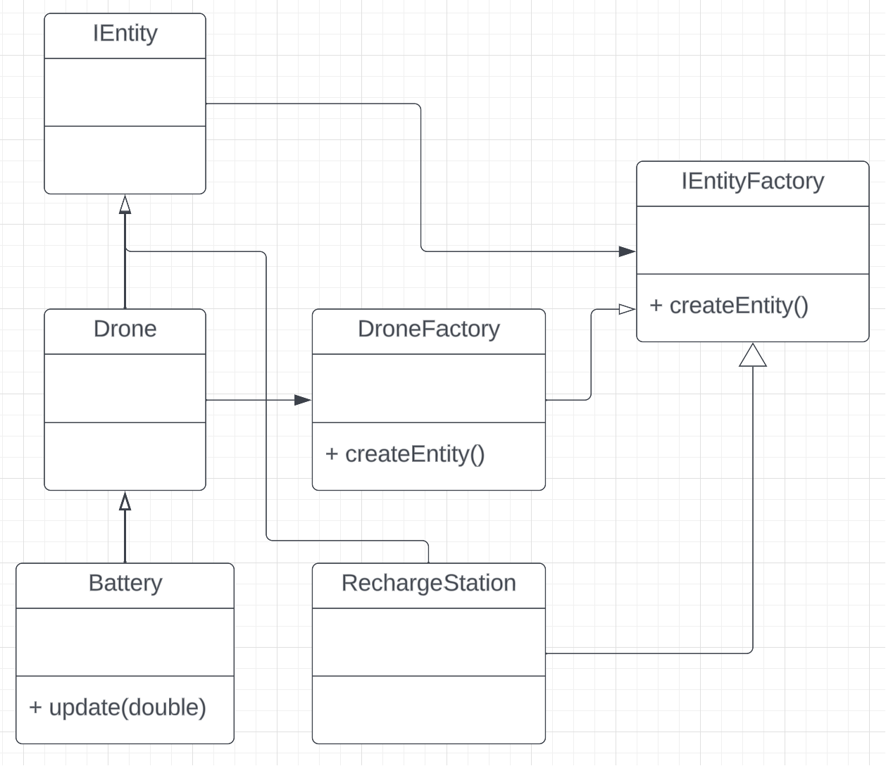

# Project Overview
### Team-001-12 HW4: Eric Fritsche (zhong464) & Nick Hiltner (hiltn042)

This project simulates a Drone delivery system using the University of Minnesota East Bank campus as the setting. Several pathing strategies are used by the Drones (which all have internal batteries) to deliver packages from any two points on the map. Most of the front end is done by the CSCI 3081W course staff as of 2023. The user is able to schedule deliveries in this simulation which models real life package delivering.

[YouTube video Link explaining the Project](https://youtu.be/eRAZXevFTKY)

[DockerHub Link to the Project Repository](https://hub.docker.com/repository/docker/nhiltner/battery_decorator_extension_drone_simulation)

### How to run the simulation
1. Pull the project from DockerHub using the link in the previous section
2. Open your favorite terminal
3. `cd` into the directory of the Docker image 
4. Use this command to run the simuulation `docker run --rm -it -p 8081:8081 <image_name>`
5. In an internet browser, go to this URL [http://localhost:8081/](http://localhost:8081/)
6. Explore around, and schedule deliveries!

### Main Simulation Features
- Drones, Helicopters, Robots, and Humans are present and moving throughout a simulated U of M East Bank Campus
- Deliveries (done by the Drones) between different points of the simulation
- Page for user to schedule deliveries
- Pathing for entities is done using a selection of path strategy algorithms

## New Feature for HW4: Battery and Recharge Station

### What & Why
Battery: Adds a battery to all Drones since most drones in the real world are electric
Recharge Station: A physical spot in the simulation where Drones can recharge

This is interesting because it more accurately models real world scenarios, since nothing has unlimited fuel. It adds to the existing work by making it a more robust model of package delivery.

### Implementation using design patterns
We used the Decorator design pattern to wrap Drone objects with Battery functionality and Factory to create every Drone to be wrapped in a Battery. This makes sense since we are adding / wrapping onto every Drone. The Factory design pattern is employed because we are creating multiple Drones (each wrapped with a Battery), which moves object creation into a seperate class, following the S of SOLID.
This feature is not directly user interactable, but Drones in the simulation should path towards Recharge Stations when their internal battery is on low charge.

### UML Diagram

